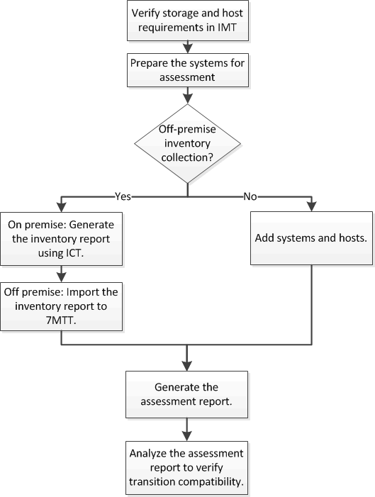

= 收集和評估庫存資訊
:allow-uri-read: 
:icons: font
:imagesdir: ../media/

[role="lead"]
您可以從控制器、主機和FC交換器收集庫存資訊。然後您可以評估這些系統的功能和特性、並找出這些功能與功能在ONTAP 選定的版本中如何在轉換中運作。

您可以用兩種方式收集庫存資訊：

* 如果環境安全性允許、您可以安裝7-Mode Transition Tool、然後使用它來收集庫存資訊。
* 您可以匯入庫存收集工具所產生的庫存XML報告、然後執行評估。

在這兩種情況下、您都必須使用Inventory Collect Tool 3.3來收集庫存。

