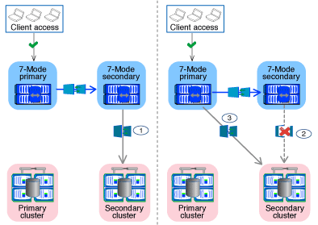

= 如何在SnapMirror關係中轉換磁碟區
:allow-uri-read: 
:icons: font
:imagesdir: ../media/

[role="lead"]
如果您想要轉換與SnapMirror關係的7-Mode磁碟區、必須先轉換次要磁碟區。然後、在7-Mode主Volume與ONTAP VMware二級Volume之間建立Volume SnapMirror關係。

在轉換主要磁碟區之後、7-Mode Transition Tool會建立ONTAP 一個磁碟區SnapMirror關係、以在各個主磁碟區和次要磁碟區之間建立Volume SnapMirror關係。

NOTE: 7-Mode Transition Tool不會自動轉換SnapLock SnapMirror關係中的《不一致》磁碟區。SnapMirror關係中的所有SnapLock 「支援功能」磁碟區都必須轉換為獨立磁碟區。將一線SnapLock 和二線的《不符合要求》磁碟區移轉至ONTAP 《支援要求》後、您必須在這些磁碟區之間手動執行SnapMirror重新同步作業。

您可以在二線和一線專案上同時執行預先檢查、基礎複本、遞增傳輸及套用組態（預先轉換）、不過、二線專案的儲存轉換必須先執行。

== 準備階段

在此階段、會選取7-Mode系統、叢集、磁碟區和IP位址。7-Mode Transition Tool會在此階段執行下列工作：

. 新增7-Mode儲存系統和Volume資訊
. 收集7-Mode來源磁碟區和SnapMirror關係的相關資訊：
+
** 若要轉換次要Volume、請收集7-Mode主要系統的相關資訊
** 若要轉換主要Volume、請收集7-Mode次要系統的相關資訊

. 執行轉換前檢查
. 新增叢集、SVM和Aggregate資訊
. 收集必須在SVM上設定的IP位址：
+
** 選取7-Mode系統上的IP位址
** 指定必須在SVM上設定的新IP位址
+

NOTE: 此工具不支援移轉iSCSI與FC LIF（SAN）。您必須在SVM上手動設定SAN LIF、才能進行轉換。

. 建立資料複本排程、以進行基準和遞增傳輸。
. 如果專案包含SnapLock 的是「資料集」、則會收集有關需要SnapLock 驗證保管鏈的讀寫能力的資訊、以及ONTAP 有關儲存保管鏈驗證作業期間所產生指紋資料的「資料集」的詳細資料。
+

NOTE: 僅讀寫7-Mode的驗證支援鏈保管驗證。SnapLock SnapLock唯讀磁碟區不支援此功能。不支援將資料鏈驗證用於包含名稱為非Ascii字元的檔案的現象。SnapLock SnapLock

. 選擇必須轉換為目標SVM和目標Volume的7-Mode組態、以規劃組態轉換。

修正預先檢查報告的錯誤和警告之後、您不得修改控制器上的物件（磁碟區、IP位址、系統資訊等）。

== 資料複製階段

在此階段、7-Mode Volume的資料會複製到ONTAP VMware Volume。7-Mode Transition Tool會在此階段執行下列工作：

. 以ONTAP 唯讀存取方式建立不完整的功能
. 在7-Mode系統和SVM之間建立轉換對等關係
. 在7-Mode Volume與ONTAP VMware Volume之間建立SnapMirror關係
. 根據排程輸入完成基準資料傳輸
. 將排程的SnapMirror資料複製更新執行ONTAP 至整個功能區

== 套用組態（預先轉換）階段

最佳實務做法是在計畫的轉換時間之前數天或數週執行*套用組態*。此預先檢查可讓您有足夠的時間來驗證是否已正確套用所有組態、以及是否需要任何變更。

在此階段、7-Mode Volume的組態會複製到ONTAP VMware Volume。

套用組態（預先轉換）階段有兩種模式：預先轉換唯讀和預先轉換讀取/寫入。

專案包含下列項目時、不支援預先轉換讀取/寫入模式：

* SAN Volume和目標叢集執行Data ONTAP 的是不含更新版本的
+
在此情況下、下列組態不會套用至套用組態（切換前）階段、而是會在切換階段套用：

+
** SAN組態
** Snapshot排程組態

* 符合法規的大量資料SnapLock
+
如果專案包含SnapLock 「不符合需求」磁碟區、則不會在「套用組態（預先轉換）」階段中套用「Snapshot排程」組態。而是會在轉換階段套用這些組態。

+
xref:concept_considerations_for_transitioning_of_snaplock_compliance_volumes.adoc[轉換SnapLock 不符合法規的考量]。

如果目標叢集執行Data ONTAP 的是EAS8.3.1或更早版本、而您想要在NAS磁碟區的讀寫模式下執行套用組態（預先轉換）作業、則必須為NAS和SAN磁碟區建立個別專案。因為如果專案中有SAN磁碟區、則不支援套用組態（預先轉換）讀取/寫入模式、因此需要執行此動作。

如果專案包含SnapLock 「循環法規遵循」磁碟區、而您想要在非SnapLock Compliance Volume的讀寫模式下執行套用組態（預先轉換）作業、則必須針對SnapLock 「循環法規遵循」磁碟區和「非SnapLock Compliance Volume」建立個別專案。如果SnapLock 您的專案中有「非指令性」磁碟區、就不支援套用組態（預先轉換）讀取/寫入模式、因此需要執行此動作。

工具會在*預先轉換唯讀模式*中執行下列步驟：

. 執行從7-Mode Volume到ONTAP VMware Volume的遞增更新
. 打破7-Mode Volume與ONTAP 非功能區之間的SnapMirror關係
+

NOTE: 對於「符合需求」磁碟區、7-Mode磁碟區與VMware磁碟區之間的SnapMirror關係不會中斷。SnapLock ONTAP這是因為ONTAP 不支援SnapLock 在7-Mode和VMware Volume之間進行SnapMirror重新同步作業、以供《不符合法規》（VMware Compliance Volume）Volume使用。

. 從7-Mode磁碟區收集組態、並將組態套用至ONTAP VMware Volume和SVM
. 設定SVM上的資料生命量：
+
** 現有的7-Mode IP位址會在SVM上以系統管理停機狀態建立。
** 新的IP位址會在SVM上以管理啟動狀態建立。

. 重新同步7-Mode Volume與ONTAP VMware Volume之間的SnapMirror關係

在*預先轉換讀寫模式*中執行下列步驟：

. 執行從7-Mode Volume到ONTAP VMware Volume的遞增更新
. 打破7-Mode Volume與ONTAP 非功能區之間的SnapMirror關係
. 從7-Mode磁碟區收集組態、並將組態套用至ONTAP VMware Volume和SVM
. 設定SVM上的資料生命量：
+
** 現有的7-Mode IP位址會在SVM上以系統管理停機狀態建立。
** 新的IP位址會在SVM上以管理啟動狀態建立。

. 在ONTAP 套用組態（切換前）測試期間、測試在測試過程中、可在測試過程中、測試對整個功能區上的讀取/寫入資料存取
+
套用組態後、ONTAP 這些資料區將可供讀取/寫入存取。套用組態後、ONTAP 即可存取讀寫功能的支援功能、以便在套用組態（預先轉換）測試期間、在這些磁碟區上測試讀寫資料存取。

. 手冊：驗證ONTAP 組態和資料存取功能
. 手冊：完成測試
+
將重新同步化此功能。ONTAP

== 儲存設備轉換（次要磁碟區）階段

下圖說明次要Volume的移轉：

|===
| 階段 | 步驟 

 a| 
儲存設備轉換（次要磁碟區）
 a| 
. 轉換次要磁碟區
. 中斷和刪除次要磁碟區之間的SnapMirror關係
. 在7-Mode主ONTAP 磁碟區和不二影像磁碟區之間建立DR關係

|===
7-Mode Transition Tool會在此階段執行下列工作：

. 選用：在ONTAP 不必要的SnapMirror磁碟區上執行SnapMirror更新
. 手動：視需要中斷用戶端存取
. 從7-Mode次要Volume執行最後的SnapMirror更新至ONTAP VMware次要Volume
. 中斷並刪除7-Mode次要Volume與ONTAP VMware次要Volume之間的SnapMirror關係、並使目的地Volume能夠讀取/寫入
. 如果目標叢集執行Data ONTAP 的是Eshot 8.3.0或8.3.1、且專案包含SAN Volume、則套用Snapshot排程組態
. 如果目標叢集執行Data ONTAP 的是E8.3.1或更早版本、則套用SAN組態
+

NOTE: 所有必要的igroup都會在此作業期間建立。對於次要磁碟區、轉換作業期間不支援將LUN對應至igroup。完成主磁碟區的儲存切換作業之後、您必須手動對應次要LUN。不過、對於次要專案中所包含的獨立磁碟區、LUN會在此作業期間對應至igroup。

. 套用配額組態（如果有）
. 在7-Mode主系統上的磁碟區與ONTAP 不二次磁碟區之間建立SnapMirror關係
+
用於更新7-Mode主磁碟區與7-Mode次磁碟區之間SnapMirror關係的SnapMirror排程、會套用至7-Mode主磁碟區與ONTAP 不二級磁碟區之間的SnapMirror關係。

. 移除現有的7-Mode IP位址、以從7-Mode系統進行轉換、並將SVM上的資料生命週期轉為管理啟動狀態
+

NOTE: SAN生命週期不會透過7-Mode Transition Tool進行轉換。

. 選用：將7-Mode磁碟區離線

== 儲存設備轉換（主要磁碟區）階段

下圖說明主Volume的移轉：

image::../media/transition_primary.gif[主要轉換]

|===
| 階段 | 步驟 

 a| 
儲存設備轉換（主要磁碟區）
 a| 
. 轉換主要磁碟區
. 中斷用戶端與7-Mode系統的連線（儲存設備轉換）
. 中斷和刪除7-Mode主ONTAP 磁碟區和VMware二線磁碟區之間的DR關係
. 中斷和刪除主要磁碟區之間的SnapMirror關係
. 設定SVM對等關係ONTAP 、使其能在二線主磁碟區和二線磁碟區之間建立關係
. 重新同步ONTAP 化不同步磁碟區之間的SnapMirror關係
. 讓用戶端能夠存取ONTAP 功能不再是功能不一

|===
7-Mode Transition Tool會在此階段執行下列工作：

. 選用：在ONTAP 不必要的SnapMirror磁碟區上執行SnapMirror更新
. 手動：中斷用戶端與7-Mode系統的存取
. 從7-Mode主Volume和ONTAP VMware主Volume執行最後的遞增更新
. 中斷並刪除7-Mode主Volume與ONTAP VMware主Volume之間的SnapMirror關係、並使目的地Volume能夠讀取/寫入
. 如果目標叢集執行Data ONTAP 的是Eshot 8.3.0或8.3.1、且專案包含SAN Volume、則套用Snapshot排程組態
. 如果目標叢集執行Data ONTAP 的是E8.3.1或更早版本、則套用SAN組態
. 套用配額組態（如果有）
. 中斷並刪除7-Mode主Volume與ONTAP VMware次要Volume之間的SnapMirror關係
. 在主要和次要叢集之間設定叢集對等和SVM對等關係
. 在主要ONTAP 和次要的不二元區之間建立SnapMirror關係
. 重新同步ONTAP 化不同步磁碟區之間的SnapMirror關係
. 移除現有的7-Mode IP位址、以從7-Mode系統進行轉換、並將主要SVM上的資料LIF移至管理啟動狀態
+

NOTE: SAN生命週期不會透過7-Mode Transition Tool進行轉換。

. 選用：將7-Mode磁碟區離線

== 驗證SnapLock 流程鏈、以利驗證資料

執行監管鏈驗證作業。

. 列舉7-Mode磁碟區的所有WORM檔案
. 計算7-Mode磁碟區上每個WORM檔案的指紋（上一步列舉）、並計算在轉換ONTAP 後的各個版本的WORM磁碟區上對應WORM檔案的指紋。
. 產生一份報告、詳細說明有相符和不相符指紋的檔案數量、以及不相符的原因

[NOTE]
====
* 只有SnapLock 檔案名稱只有使用Ascii字元的讀寫能力、才支援監管鏈驗證作業。
* 根據7-Mode SnapLock 的資料量、這項作業可能需要大量的時間。

====

== 轉換後步驟

在轉換階段成功完成並完成轉換之後、您必須執行下列轉換後工作：

. 執行任何可在7-Mode系統上使用、但工具並未自動轉換至SVM的手動步驟。
. 如果目標叢集執行Data ONTAP 的是不含更新版本的版本、您必須手動對應次要LUN。
. 對於SAN轉換、請手動重新設定主機。
+
http://["SAN主機移轉與補救"]

. 驗證下列項目、確保SVM已準備好提供資料給用戶端：
+
** SVM上的磁碟區已上線並可讀寫。
** 轉換後的IP位址會在SVM上啟動並可存取。

. 將用戶端存取重新導向ONTAP 至功能區。

*相關資訊*

xref:task_transitioning_volumes_using_7mtt.adoc[從7-Mode磁碟區移轉資料與組態]
