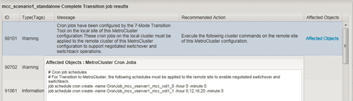

= 在轉換MetroCluster 完一套功能表後、在遠端站台上設定cron工作排程
:allow-uri-read: 
:icons: font
:imagesdir: ../media/

[role="lead"]
在轉換期間建立的cron工作排程不會複寫到遠端站台、因此轉換後交涉的切換作業會失敗。轉換後、您必須在遠端站台上手動建立cron工作排程。

7-Mode作用中站台的儲存轉換必須已成功完成。

.步驟
. 記錄儲存轉換時產生的cron工作訊息、以識別必須複寫到遠端站台的工作排程。
+

. 從遠端站台的叢集CLI中、執行中記錄的「工作排程cron create」命令 ,步驟1.。

