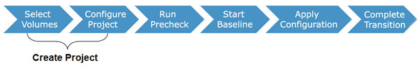

= 從7-Mode磁碟區移轉資料與組態
:allow-uri-read: 
:icons: font
:imagesdir: ../media/

[role="lead"]
若要使用7-Mode Transition Tool移轉磁碟區或磁碟區SnapMirror關係、您必須先設定專案、開始基礎複本、然後完成專案。

* 您要納入轉換的7-Mode控制器和叢集必須可從安裝此工具的Windows主機存取。
* 您必須擁有要納入轉換專案之控制器和叢集的所有系統管理員層級權限。
* 7-Mode Transition Tool服務必須在安裝該服務的機器上執行。
+
此服務預設為自動、應在重新啟動機器時啟動。

* 您不應同時在控制器上執行評估與移轉作業。
* 在修正預先檢查報告的錯誤和警告之後、您不應該修改7-Mode控制器和叢集上的物件（磁碟區、IP位址、系統資訊等）。
* 您應該避免使用同時寫入同一個SVM的多個Web介面工作階段、以避免產生不必要的結果。
* 您應該避免在轉換過程中修改控制器和叢集密碼。
* 您應該避免使用「*上一步*」和「*下一頁*」瀏覽器按鈕、因為此工具不支援網頁瀏覽器導覽、可能會導致不必要的結果。
* 您應該避免在進行轉換時重新整理瀏覽器、因為這可能會導致不必要的結果。

下圖說明移轉程序：

*相關資訊*

xref:concept_how_you_transition_a_stand_alone_volume.adoc[如何轉換獨立Volume]

xref:concept_how_you_transition_volumes_in_a_snapmirror_relationship.adoc[如何在SnapMirror關係中轉換磁碟區]
