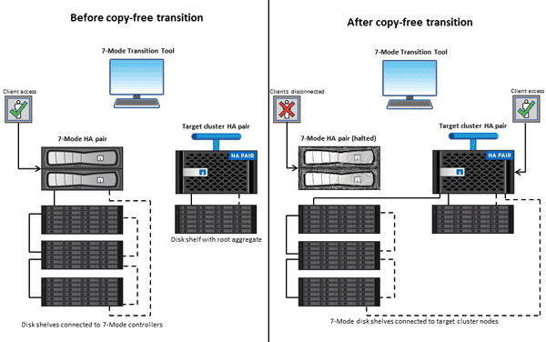

= 使用7-Mode Transition Tool進行無複本轉換
:allow-uri-read: 
:icons: font
:imagesdir: ../media/

[role="lead"]
7-Mode Transition Tool可讓您收集庫存、並評估7-Mode控制器、主機、交換器及應用程式以進行轉換。評估完成後、您可以使用無複製的移轉功能、將資料和組態移轉至ONTAP 無法複製的環境。在無複本轉換中、您會從7-Mode HA配對中斷所有磁碟櫃的連線、並將其連線至目標叢集中的HA配對。

無需複製的移轉作業可重複使用7-Mode磁碟櫃、大幅降低移轉成本。執行轉換的整體持續時間較短、因為不需要資料複製。

無複製轉換的單元是HA配對。您必須將所有磁碟櫃從7-Mode HA配對移至目標叢集節點。

7-Mode ONTAP Transition Tool會將7-Mode Aggregate和Volume的中繼資料轉換為VMware格式。此轉換所需的時間不取決於集合體和磁碟區的大小。例如、將10 GB Aggregate轉換為ONTAP 申請表格式所需的時間、與轉換100 TB Aggregate所需的時間相同。

無複製移轉作業會中斷資料存取。不過、執行資料移轉所需的總時間較快、因為不需要資料複製。

下圖顯示從7-Mode HA配對無複製移轉至雙節點叢集的「之前」和「之後」案例：

7-Mode Transition Tool可在Windows系統上執行、並提供Web介面來管理轉換作業。

== 收集並評估ONTAP 各種系統、主機、交換器和應用程式

您可以使用7-Mode Transition Tool執行下列收集與評估工作：

* 收集ONTAP 來自各個不支援的系統（叢集中的7-Mode控制器和節點）、主機、交換器和主機應用程式的庫存資訊。
* 產生FC區域計畫、以設定SAN FC移轉的區域。
* 評估7-Mode系統的特色與功能、並找出這些功能與功能在ONTAP 選定的版本中如何在轉換過程中運作。

== 將資料和組態從7-Mode移至ONTAP 不完整

無複製轉換會重新使用7-Mode磁碟櫃、將7-Mode資料從7-Mode複製到ONTAP VMware。您可以使用7-Mode Transition Tool執行下列工作、以進行無複本移轉：

* 規劃轉換作業、將7-Mode控制器或vFiler單元對應至目標SVM、並設計命名空間。
* 執行預先檢查、以驗證7-Mode系統與目標叢集節點之間的相容性、以便進行轉換。
* 以下列方式匯入7-Mode磁碟櫃：
+
** 從7-Mode HA配對到新叢集中的新HA配對
** 從7-Mode HA配對到現有叢集中新的HA配對、該叢集具有額外的資料服務節點
** 從7-Mode HA配對到HA配對、該配對在現有叢集中具有資料集合體、用於處理資料
** 從包含Volume SnapMirror中磁碟區的HA配對、到新叢集或現有叢集中的HA配對
+
您必須在轉換後手動建立叢集對等關係、但不需要重新建立基礎傳輸、而且可以在轉換後保留SnapMirror關係。

* 將7-Mode組態轉換為SVM。
+
無複製移轉支援NAS和SAN組態的移轉。

* 如果轉換ONTAP 至VMware不正常、可將儲存設備和組態回復至7-Mode。
+
此工具會產生回溯至7-Mode所需的步驟清單。您必須在7-Mode系統和叢集上手動執行這些復原步驟。

